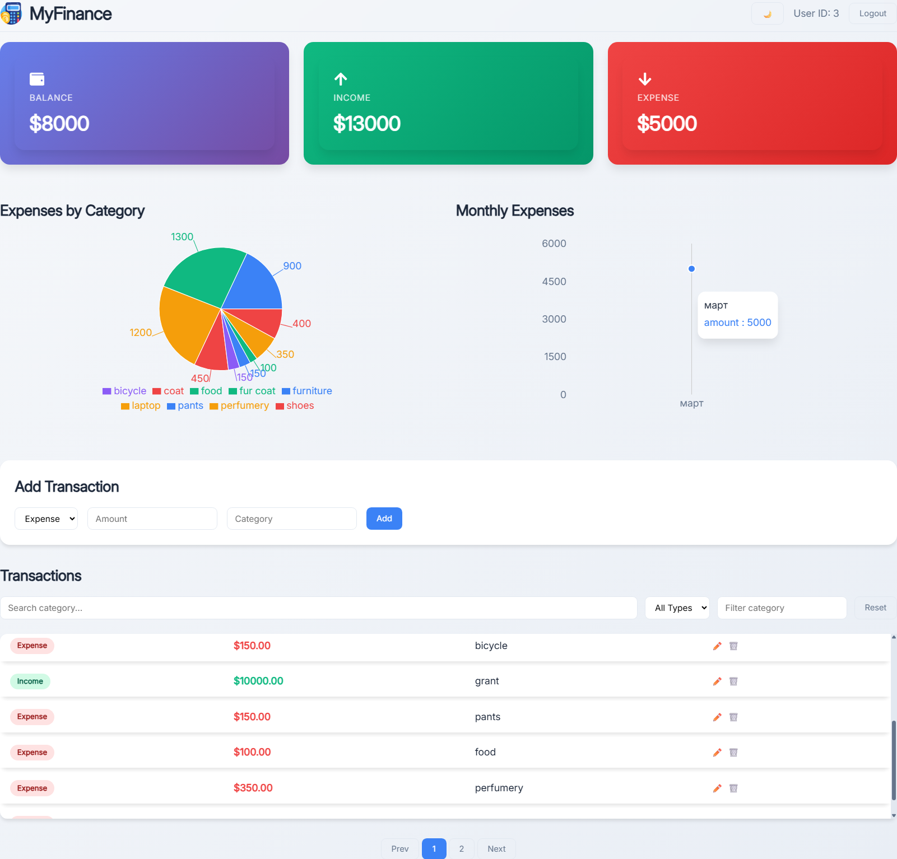
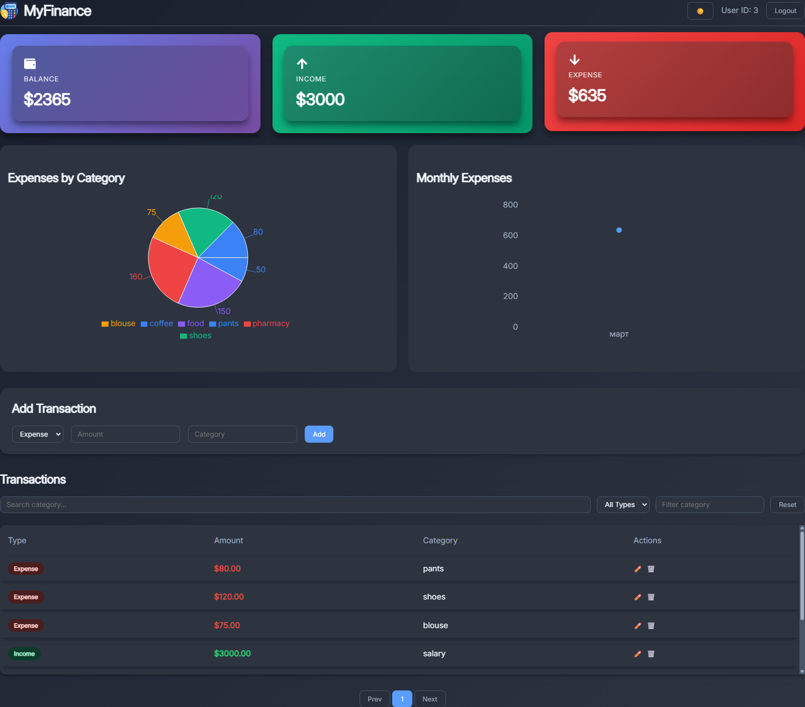
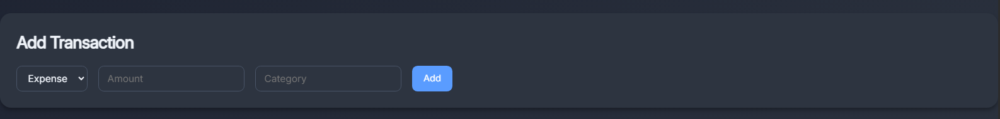
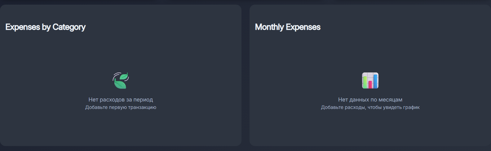
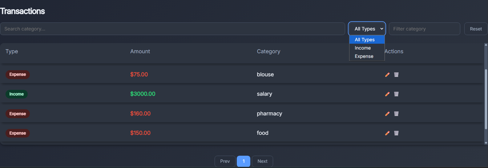
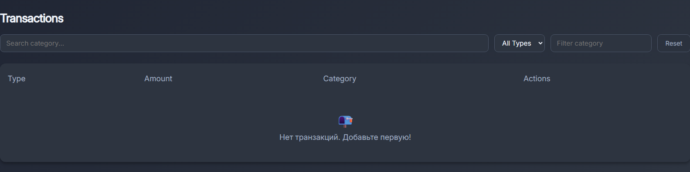

# MyFinance — Personal Finance Management System


> **MyFinance** — это полноценное клиент-серверное приложение для учёта личных финансов. Оно позволяет добавлять доходы и расходы, просматривать статистику в виде графиков, фильтровать транзакции и переключать тёмную тему. Проект разработан в учебных целях и демонстрирует навыки работы с современным стеком технологий.

🔗 **[Демо-версия на GitHub Pages](https://zalina-devops.github.io/personal-finance-client-server)**  
*В демо-режиме используются моковые данные, изменения не сохраняются.*

---

## 📸 Скриншоты

| Светлая тема | Тёмная тема |
|--------------|-------------|
|  |  |

| Добавление транзакции | Пустое состояние |
|-----------------------|------------------|
|  |  |

| Таблица с фильтрами | Пустая таблица |
|---------------------|----------------|
|  |  |

---

## 🚀 Функциональность

### Клиентская часть (Frontend)
- ✅ Регистрация и авторизация пользователей (JWT)
- ✅ Добавление, редактирование и удаление транзакций (доходы/расходы)
- ✅ Фильтрация по типу (все / доходы / расходы) и по категории
- ✅ Визуализация расходов по категориям (круговая диаграмма)
- ✅ График расходов по месяцам
- ✅ Валидация форм (сумма > 0, категория не пустая)
- ✅ Пустые состояния — дружелюбные заглушки, когда нет данных
- ✅ Тёмная тема с переключением (используется Context API + CSS-переменные)
- ✅ Адаптивный дизайн для мобильных устройств
- ✅ Пагинация в таблице транзакций
- ✅ Демо-режим с моковыми данными (для GitHub Pages)

### Серверная часть (Backend)
- ✅ REST API на Express.js
- ✅ Аутентификация с JWT (bcrypt для хеширования паролей)
- ✅ PostgreSQL база данных (таблицы `users`, `transactions`)
- ✅ Docker-контейнеризация (бэкенд + БД)
- ✅ Rate limiting для защиты от брутфорса
- ✅ CORS, Helmet для безопасности
- ✅ Подготовленные SQL-запросы (без ORM)

---

## 🛠 Технологии

### Frontend
- **React** + **Vite** — быстрая разработка и сборка
- **React Router** — навигация
- **Recharts** — графики (круговая диаграмма, линейный график)
- **Axios** — HTTP-запросы
- **CSS-переменные** + **Flexbox/Grid** — стилизация
- **React Context** — глобальное состояние темы
- **React Icons** — иконки

### Backend
- **Node.js** + **Express** — сервер
- **PostgreSQL** — база данных
- **jsonwebtoken** — JWT
- **bcrypt** — хеширование паролей
- **pg** — драйвер для PostgreSQL
- **express-rate-limit** — ограничение запросов
- **helmet** + **cors** — безопасность
- **dotenv** — переменные окружения

### Инфраструктура
- **Docker** + **Docker Compose** — контейнеризация бэкенда и БД
- **GitHub Pages** — хостинг демо-версии фронтенда
- **Git** — контроль версий

---

## 📦 Установка и локальный запуск

### Предварительные требования
- [Docker](https://www.docker.com/) и Docker Compose (для бэкенда)
- [Node.js](https://nodejs.org/) (v16+)

### 1. Клонирование репозитория
```bash
git clone https://github.com/zalina-devops/personal-finance-client-server.git
cd personal-finance-client-server
```
### 2. Настройка переменных окружения (бэкенд)
Создайте файл .env в папке server (рядом с index.js):
```bash
PORT=5000

DATABASE_HOST=localhost
DATABASE_PORT=5432
DATABASE_USER=postgres
DATABASE_PASSWORD=your_password
DATABASE_NAME=personal_finance_db

JWT_SECRET=supersecretkey
```
### 3. Запуск бэкенда и базы данных через Docker
```bash
docker-compose up --build
```
- PostgreSQL станет доступен на порту 5432
- Бэкенд API — на http://localhost:5000

### 4. Запуск фронтенда
В новом терминале выполните:
```
cd client
npm install
npm run dev
```
Фронтенд откроется на http://localhost:5173

### 5. Создание таблиц в базе (если не создались автоматически)
После первого запуска может потребоваться создать таблицы вручную. Подключитесь к контейнеру PostgreSQL:
```
docker exec -it finance_postgres psql -U postgres -d personal_finance_db
```
Выполните SQL:
```
CREATE TABLE IF NOT EXISTS users (
    id SERIAL PRIMARY KEY,
    email VARCHAR(255) UNIQUE NOT NULL,
    password VARCHAR(255) NOT NULL,
    created_at TIMESTAMP DEFAULT NOW()
);

CREATE TABLE IF NOT EXISTS transactions (
    id SERIAL PRIMARY KEY,
    user_id INTEGER REFERENCES users(id) ON DELETE CASCADE,
    type VARCHAR(50) NOT NULL CHECK (type IN ('income', 'expense')),
    amount DECIMAL(10, 2) NOT NULL,
    category VARCHAR(255) NOT NULL,
    created_at TIMESTAMP DEFAULT NOW()
);
```
## 🔌 API Endpoints (бэкенд)

| Метод | URL | Описание | Тело запроса (JSON) |
|-------|-----|------------|-------------------|
| POST | /api/auth/register | Регистрация | { "email", "password" } |
| POST | /api/auth/login | Вход | { "email", "password" } |
| GET  | /api/protected | Проверка токена (защищённый маршрут) | — |
| GET  | /api/transactions | Получить все транзакции пользователя (с опциональными query-параметрами search, type, category) | — |
| POST | /api/transactions | Добавить транзакцию | { "type", "amount", "category" } |
| PUT  | /api/transactions/:id | Обновить транзакцию | { "type", "amount", "category" } |
| DELETE  | /api/transactions/:id  | Удалить транзакцию  | — |

## 🌐 Демо-версия (GitHub Pages)

**Фронтенд доступен по адресу:**

👉 [zalina-devops.github.io/personal-finance-client-server](https://zalina-devops.github.io/personal-finance-client-server)

В демо-версии используется режим моковых данных (заглушка API). Это позволяет просматривать интерфейс без запуска бэкенда. Все операции (добавление, редактирование, удаление) заблокированы и показывают уведомление.

## 🧪 Тестирование (опционально)

Проект пока не покрыт тестами, но планируется добавить:

- **Unit-тесты для компонентов** (Jest + React Testing Library)
- **Интеграционные тесты для API** (Supertest)

## 📁 Структура проекта
```
personal-finance-client-server/
├── .gitignore
├── docker-compose.yml
├── LICENSE
├── README.md
├── client/
│   ├── .env.production
│   ├── index.html
│   ├── package-lock.json
│   ├── package.json
│   ├── vite.config.js
│   ├── dist/
│   │   ├── favicon.ico
│   │   ├── index.html
│   │   ├── logo.png
│   │   ├── vite.svg
│   │   └── assets/
│   │       ├── index-DdFUkfzd.css
│   │       └── index-DOL9jUxt.js
│   ├── public/
│   │   ├── favicon.ico
│   │   ├── logo.png
│   │   └── vite.svg
│   └── src/
│       ├── App.jsx
│       ├── main.jsx
│       ├── api/
│       │   ├── api.js
│       │   ├── apiReal.js
│       │   ├── auth.js
│       │   ├── mockData.js
│       │   └── user.js
│       ├── components/
│       │   └── ProtectedRoute.jsx
│       ├── context/
│       │   └── ThemeContext.jsx
│       ├── hooks/
│       ├── pages/
│       │   ├── Dashboard.jsx
│       │   ├── Login.jsx
│       │   └── Dashboard/
│       │       ├── ExpensePieChart.jsx
│       │       ├── MonthlyChart.jsx
│       │       ├── SummaryCards.jsx
│       │       └── TransactionTable.jsx
│       ├── styles/
│       │   └── global.css
│       └── utils/
├── screenshots/
└── server/
    ├── .env
    ├── Dockerfile
    ├── package-lock.json
    ├── package.json
    └── src/
        ├── index.js
        ├── config/
        │   └── db.js
        ├── controllers/
        │   ├── authController.js
        │   └── transactionController.js
        ├── middleware/
        │   ├── authMiddleware.js
        │   └── errorMiddleware.js
        ├── models/
        │   ├── transactionModel.js
        │   └── userModel.js
        ├── routes/
        │   ├── authRoutes.js
        │   └── transactionRoutes.js
        ├── services/
        │   ├── authService.js
        │   └── transactionService.js
        └── utils/
            └── ApiError.js
```

## 📌 Планы по развитию

- Добавить экспорт транзакций в CSV/PDF
- Создать возможность редактирования категорий
- Улучшить адаптивность для планшетов
- Написать тесты (фронтенд и бэкенд)
- Развернуть бэкенд на бесплатном хостинге (Render/Railway) для полноценной демо-версии
- Добавить страницу статистики с расширенными отчётами

## 🤝 Как внести вклад

Если у вас есть идеи по улучшению проекта, вы можете:

- Сделать форк репозитория
- Создать ветку для своей функции (`git checkout -b feature/amazing`)
- Закоммитить изменения (`git commit -m 'Add some amazing feature'`)
- Запушить ветку (`git push origin feature/amazing`)
- Открыть Pull Request

## 📄 Лицензия
Этот проект распространяется под лицензией MIT. Подробнее см. файл LICENSE.

## 👩‍💻 Автор
Залина — студентка 3-го курса по специальности 09.02.07.

**GitHub:** [@zalina-devops](https://github.com/zalina-devops)

Проект создан в учебных целях и будет использоваться в портфолио.

----
**Если вам понравился проект, не забудьте поставить ⭐ на GitHub!**
